# Architecture Documentation

This document describes the system architecture, design patterns, and technical decisions for the Auth Expo application.

## Table of Contents

- [System Overview](#system-overview)
- [Architecture Patterns](#architecture-patterns)
- [Component Architecture](#component-architecture)
- [Data Flow](#data-flow)
- [Authentication Flow](#authentication-flow)
- [Navigation Architecture](#navigation-architecture)
- [API Integration](#api-integration)
- [State Management](#state-management)
- [Testing Architecture](#testing-architecture)
- [Build & Deployment](#build--deployment)

---

## System Overview

Auth Expo is a cross-platform mobile application built with React Native and Expo, implementing a modern client-server architecture with JWT-based authentication.

### High-Level Architecture

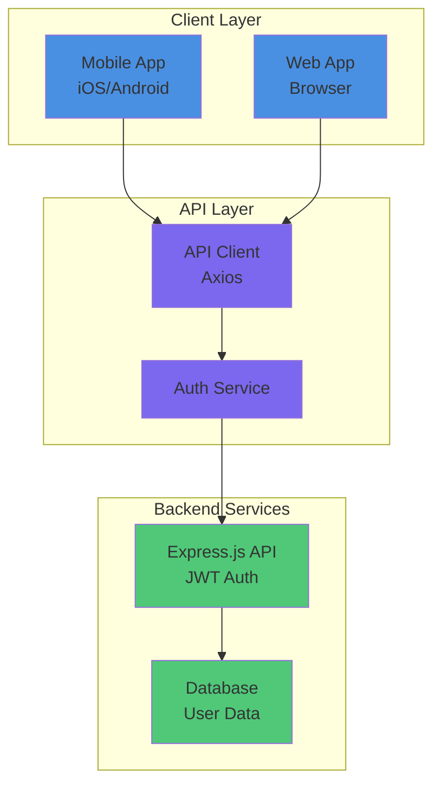

### Technology Stack

| Layer          | Technology     | Purpose                    |
| -------------- | -------------- | -------------------------- |
| **Framework**  | Expo SDK 54    | Cross-platform development |
| **Language**   | TypeScript     | Type-safe development      |
| **UI Library** | React Native   | Native UI components       |
| **Styling**    | NativeWind     | Tailwind-based styling     |
| **Navigation** | Expo Router    | File-based routing         |
| **State**      | React Context  | Global state management    |
| **HTTP**       | Axios          | API communication          |
| **Storage**    | AsyncStorage   | Local data persistence     |
| **Testing**    | Jest + RTL     | Unit and integration tests |
| **CI/CD**      | GitHub Actions | Automated workflows        |

---

## Architecture Patterns

### 1. Feature-Based Architecture

The project follows a feature-based folder structure:

```
app/
├── (auth)/          # Authentication feature
├── (tabs)/          # Main app feature
api/                 # API integration
contexts/            # Global state
components/          # Shared UI
```

### 2. Clean Architecture Principles

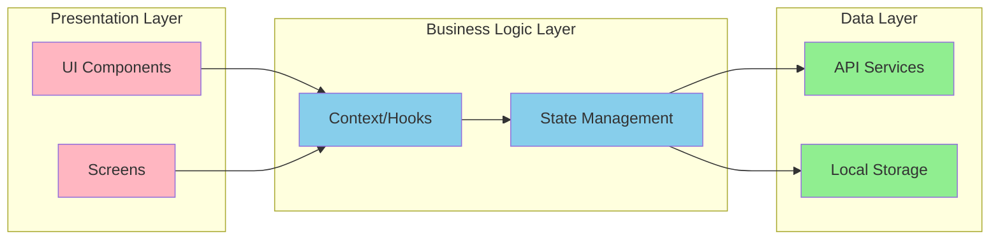

### 3. Separation of Concerns

- **UI Layer**: Pure presentational components
- **Business Logic**: Context providers and hooks
- **Data Layer**: API clients and storage utilities
- **Type Layer**: Shared type definitions

---

## Component Architecture

### Component Hierarchy

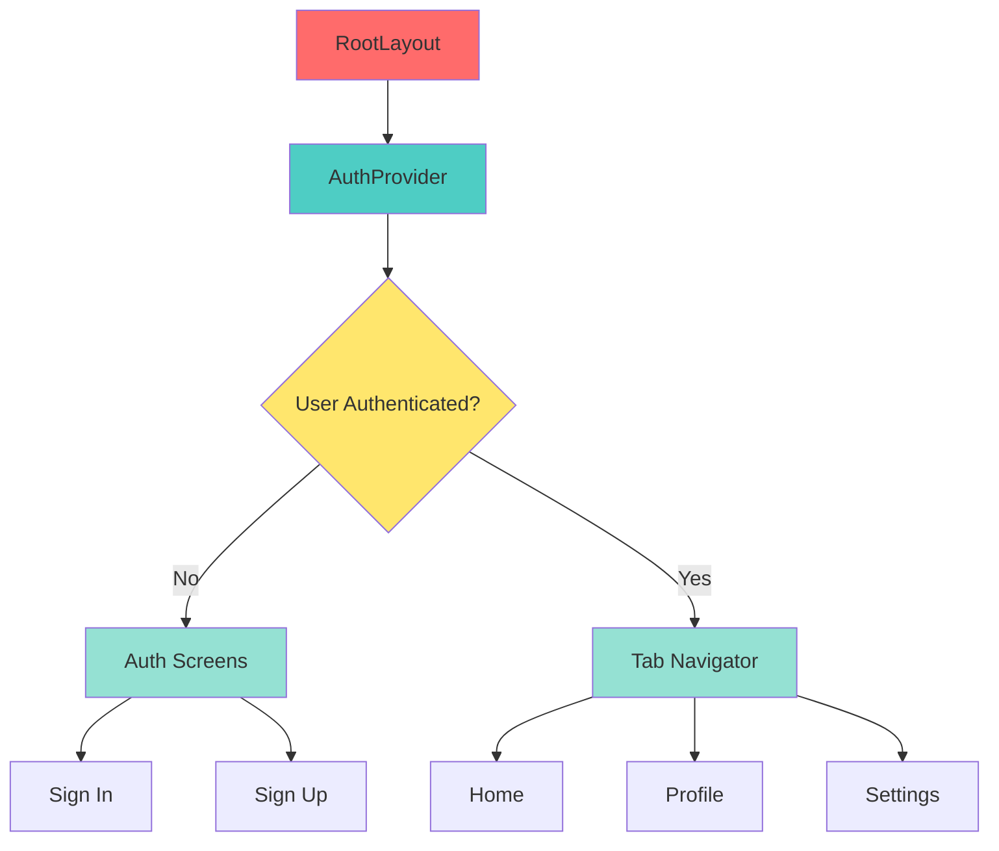

### Component Types

#### 1. Layout Components

- **Purpose**: Define screen structure and navigation
- **Examples**: `_layout.tsx`, `RootLayout`
- **Responsibilities**: Route protection, navigation setup

#### 2. Screen Components

- **Purpose**: Full-page views
- **Examples**: `sign-in.tsx`, `profile.tsx`
- **Responsibilities**: User interaction, data display

#### 3. UI Components

- **Purpose**: Reusable interface elements
- **Examples**: `Button`, `Input`, `Container`
- **Responsibilities**: Consistent UI, styling

#### 4. Context Providers

- **Purpose**: Global state management
- **Examples**: `AuthProvider`
- **Responsibilities**: State distribution, business logic

---

## Data Flow

### Unidirectional Data Flow

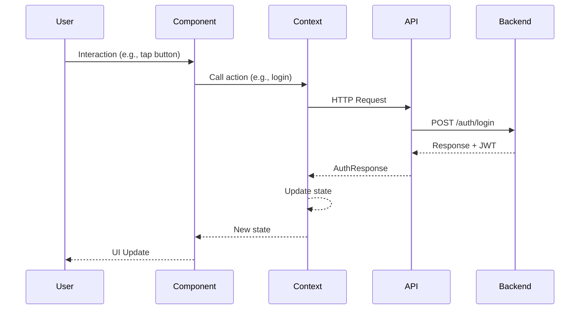

### State Updates

1. **User Action**: Button press, form submission
2. **Context Action**: Async function called
3. **API Request**: HTTP call to backend
4. **Response Handling**: Success or error
5. **State Update**: Context state changed
6. **UI Re-render**: Components reflect new state

---

## Authentication Flow

### Registration Flow

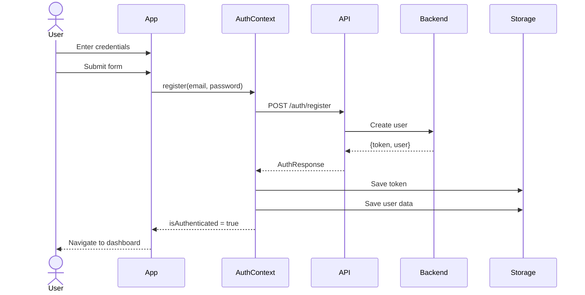

### Login Flow

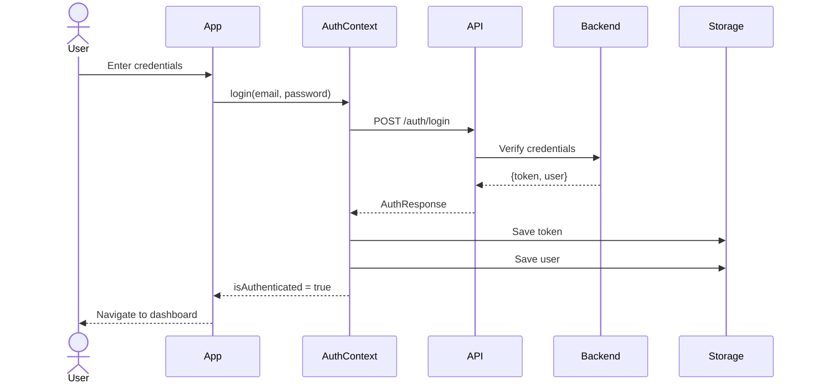

### OAuth Flow

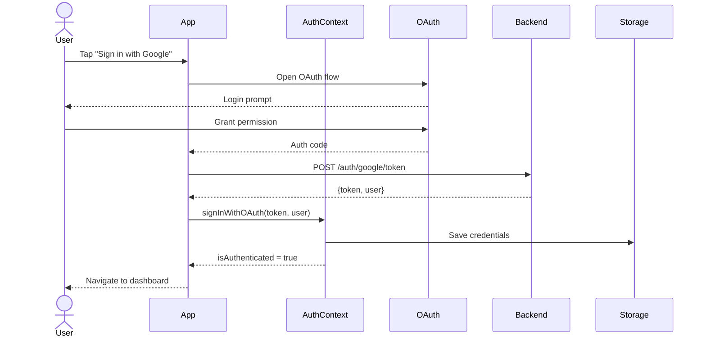

### Session Persistence

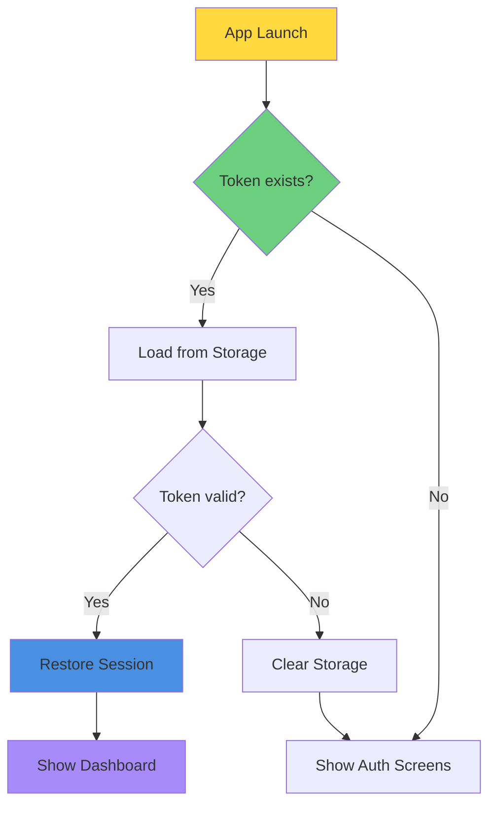

---

## Navigation Architecture

### Route Structure

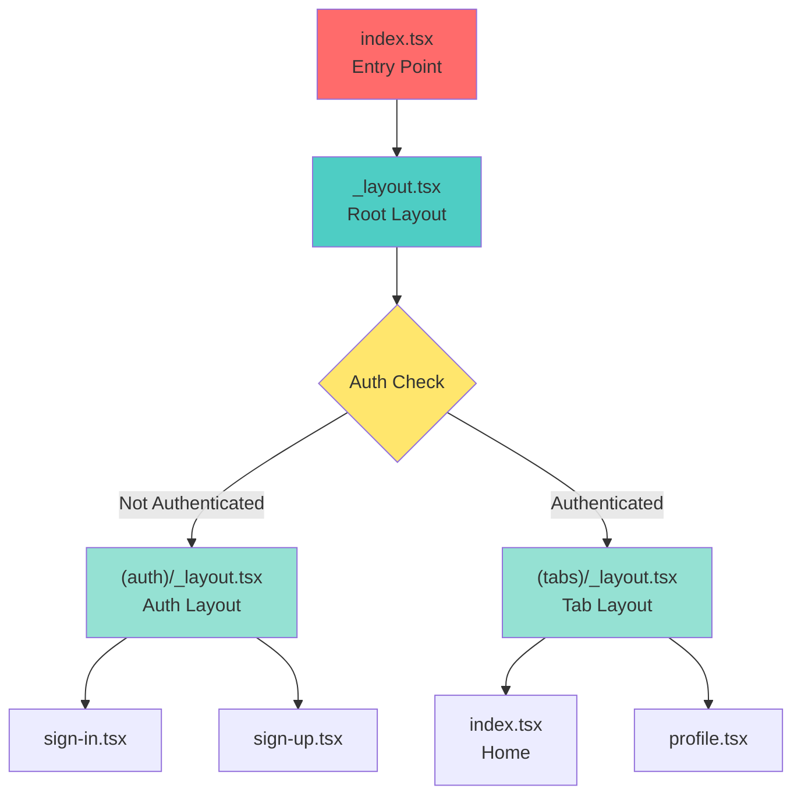

### Route Protection

Routes are protected at the layout level using the `NavigationProtection` component:

```typescript
// Simplified protection logic
if (!isAuthenticated && inProtectedRoute) {
  router.replace('/(auth)/sign-in');
}

if (isAuthenticated && inAuthRoute) {
  router.replace('/(tabs)');
}
```

---

## API Integration

### API Client Architecture

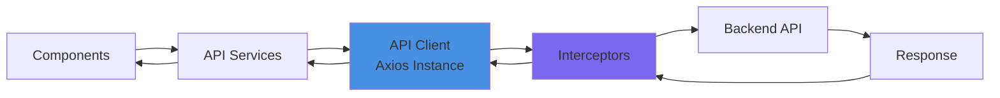

### Request/Response Flow

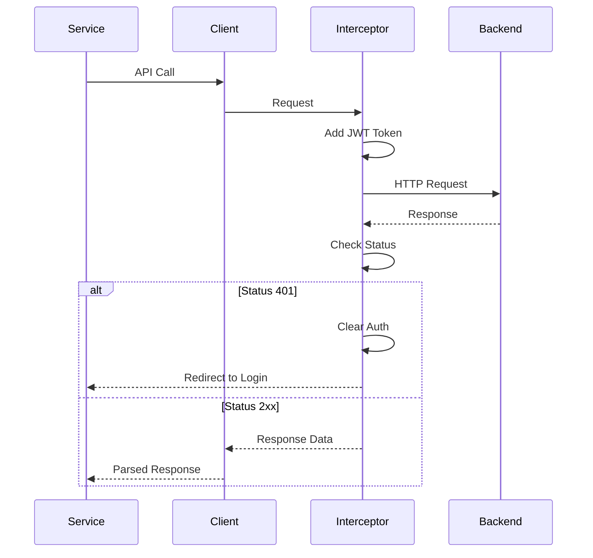

### Error Handling

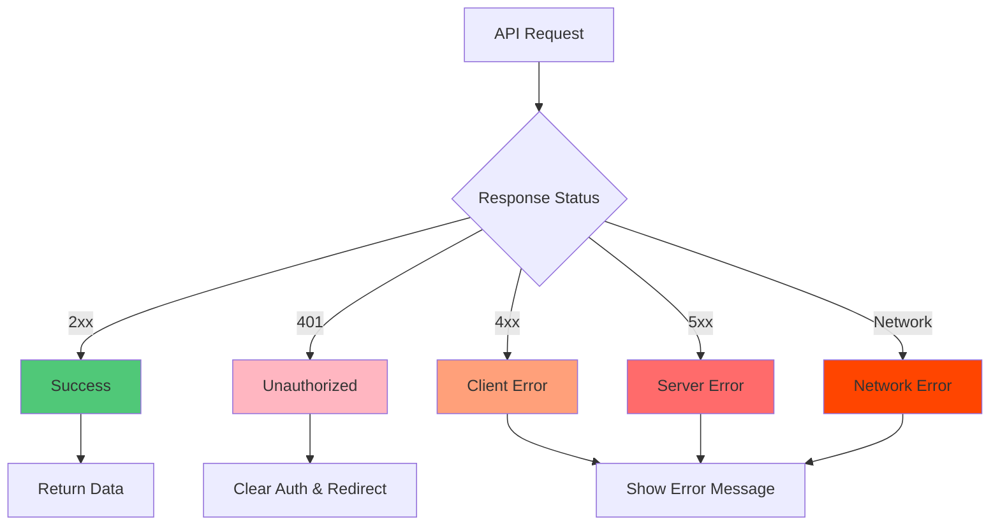

---

## State Management

### Context-Based State

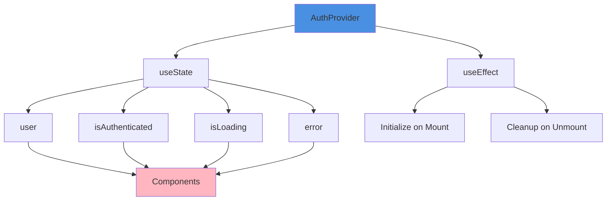

### State Update Flow

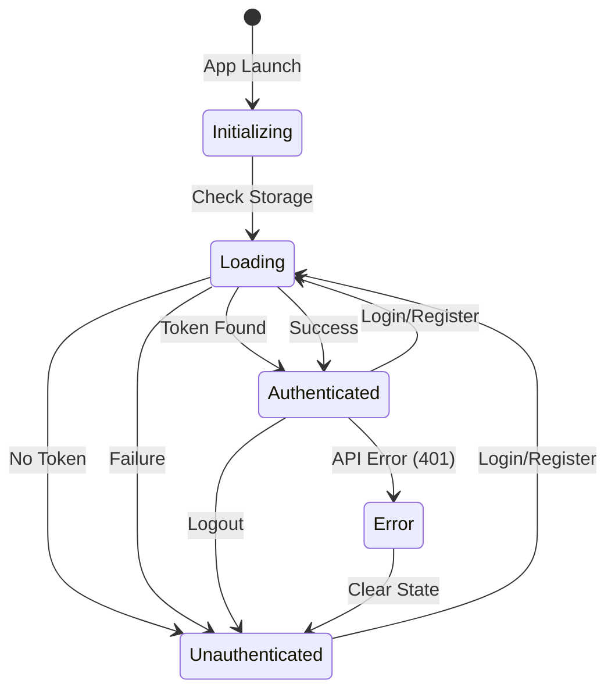

---

## Testing Architecture

### Testing Strategy

The project implements a comprehensive testing approach with multiple layers:

| Layer           | Tool       | Tests    | Coverage           |
| --------------- | ---------- | -------- | ------------------ |
| **E2E**         | Maestro    | 10 flows | Full user journeys |
| **Screen**      | Jest + RTL | 22+      | 70%+               |
| **Component**   | Jest + RTL | 21+      | 85%+               |
| **Integration** | Jest       | 9        | 98%                |
| **Unit**        | Jest       | 34+      | 75%+               |

**Total**: 96+ tests | Execution: ~4-10s (Jest), ~40-45min (Maestro)

### Test Structure

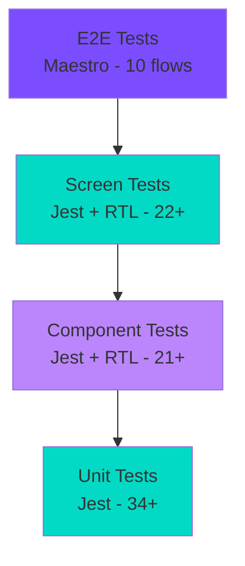

**Mocking Strategy:**

- API Client: `__mocks__/api/client.ts`
- AsyncStorage: `@react-native-async-storage/async-storage/jest`
- Expo Modules: `jest.setup.js`

**See [TESTING.md](./TESTING.md) for complete testing guide.**

---

## Build & Deployment

### CI/CD Pipeline

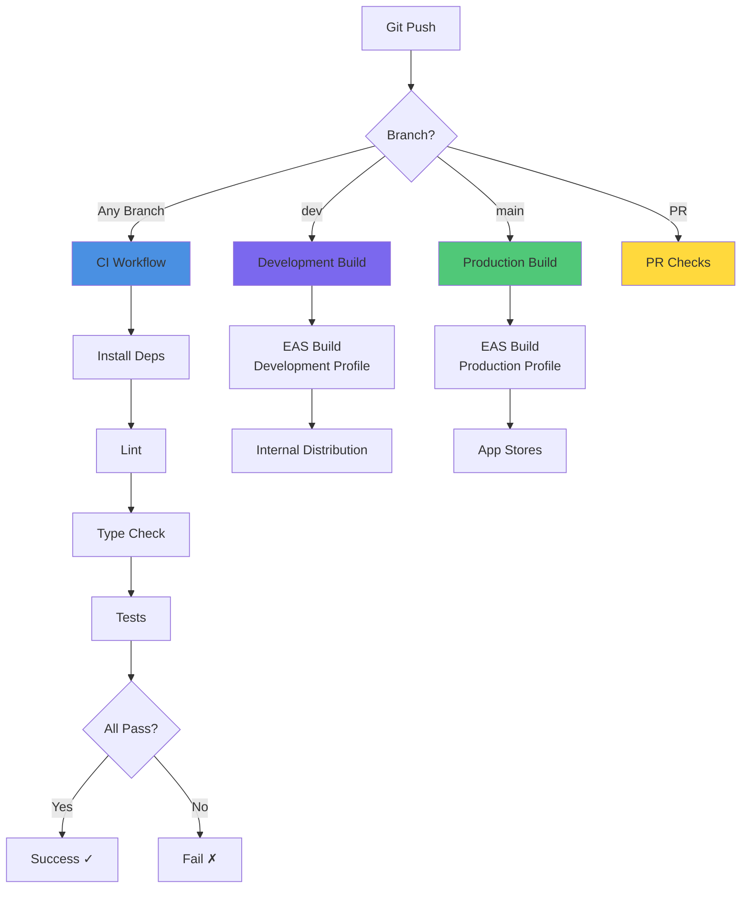

### Build Profiles

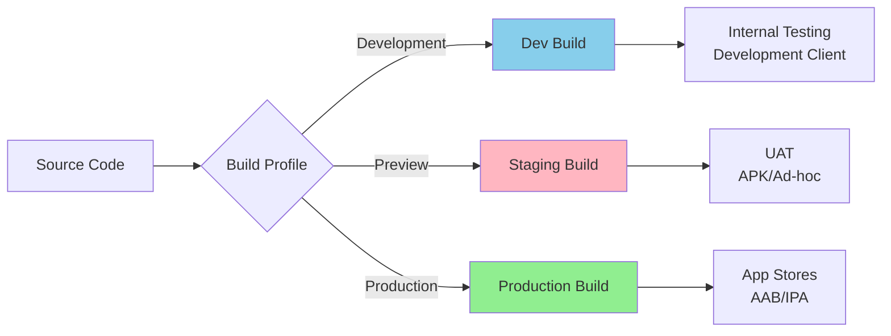

---

## Design Principles

### 1. Separation of Concerns

- **UI**: Pure presentational components
- **Logic**: Business logic in contexts/hooks
- **Data**: API and storage abstraction

### 2. Single Responsibility

- Each module has one clear purpose
- Components focus on rendering
- Services handle data operations

### 3. Dependency Injection

- Contexts provide dependencies
- Mock implementations for testing
- Loose coupling between layers

### 4. Type Safety

- TypeScript for all code
- Strict mode enabled
- Shared type definitions

### 5. Testability

- Unit tests for business logic
- Component tests for UI
- Integration tests for workflows
- Mocked dependencies

---

## Security Considerations

### Authentication Security

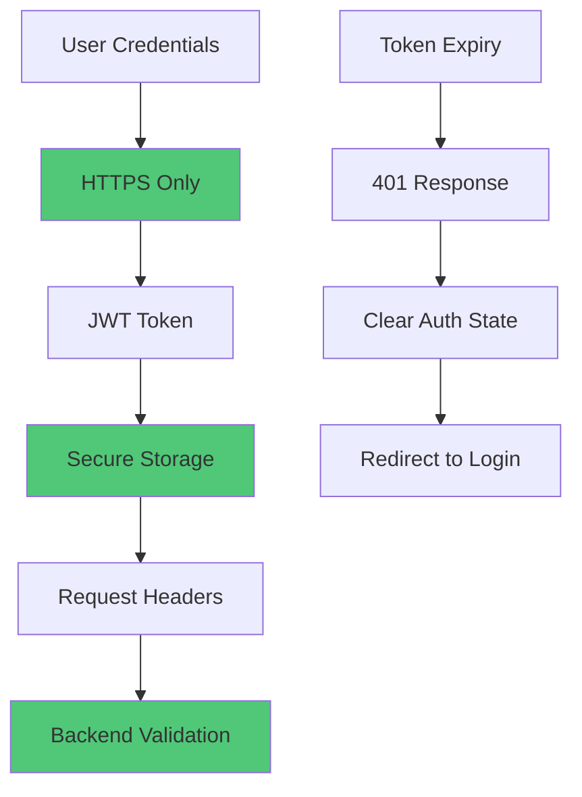

### Security Measures

1. **Transport Security**: HTTPS for all API calls
2. **Token Storage**: Encrypted AsyncStorage
3. **Token Transmission**: Authorization header only
4. **Auto-Logout**: On 401 responses
5. **Input Validation**: Client and server-side
6. **Environment Secrets**: Never committed to git

---

## Performance Optimizations

### 1. Code Splitting

- Lazy loading of screens
- Dynamic imports for large modules

### 2. Memoization

- `React.memo` for expensive components
- `useMemo` for computed values
- `useCallback` for stable callbacks

### 3. Caching

- API response caching
- Image caching with Expo
- AsyncStorage for persistence

### 4. Bundle Size

- Tree shaking unused code
- Minification in production
- Optimized imports

---

## Scalability Considerations

### Future Enhancements

1. **State Management**: Migrate to Redux/Zustand for complex state
2. **API Layer**: Implement React Query for caching
3. **Offline Support**: Add offline-first capabilities
4. **Analytics**: Integrate tracking and monitoring
5. **Error Tracking**: Add Sentry integration
6. **Push Notifications**: Implement notification system
7. **Deep Linking**: Support universal links

---

## References

- [Expo Documentation](https://docs.expo.dev/)
- [React Native Documentation](https://reactnative.dev/)
- [TypeScript Best Practices](https://www.typescriptlang.org/docs/)
- [Testing Library](https://testing-library.com/react-native)
- [Clean Architecture](https://blog.cleancoder.com/uncle-bob/2012/08/13/the-clean-architecture.html)

---

**Last Updated**: November 5, 2025  
**Maintained By**: Development Team
